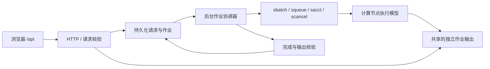

# 登录节点后端技术方案

2026-09-10 当前实现修订：工作流已完成真实验收；作业存储改为 `projects/<稳定项目 ID>/jobs/<作业 ID>`，已迁移历史终态产物。本文其余 `var/jobs` 描述为首版设计，当前实现以 [部署说明](backend-deployment.md) 和 [目录与交互修复](workflow-usability-and-storage.md) 为准。

日期：2026-09-09。状态：生成与 Slurm 后端代码、Web 依赖与 HTTP 部署已完成；真实 Slurm/GPU 推理待模型权重齐备后联调。

本文承接 [部署架构](deployment-architecture.md)、[Slurm 执行规格](slurm-execution.md) 与 [生成面板契约](generation-panel.md)。遵循先文档、后代码；本文描述实现约束，不表示服务、模型或 GPU 作业已经部署验证。

## 1. 已确认边界与本次待确认项

已确认：HTTP 后端运行在当前登录节点；所有模型推理通过 Slurm 调度至计算节点；兼容现有 API v2 生成客户端；同源入口使用 `/api`。本次文件查看、修改及测试数据均限定在 `/home/225015066/dev-projects/DiffusionControl`。项目外的模型、权重、共享目录及服务配置需要用户另行授权访问。依赖可安装在当前 Conda `base`，不创建另一套 Python 环境，不执行 `conda init` 或修改用户 shell 配置。

实施前检查：仓库只有 React/TypeScript 前端，没有后端实现。当前进程环境为 Conda `base`，可定位 `sbatch/squeue/sacct/scancel`；尚未验证这些命令与集群的通信、配额或计算节点挂载情况。当前已实现模块与运行步骤见 [部署说明](backend-deployment.md)。

| 决策 | 建议 | 确认状态 |
| --- | --- | --- |
| 本轮范围 | 生成 API、Slurm、持久化、日志与产物 | 用户已确认 |
| API 框架及运行方式 | FastAPI，单个应用进程；后台协调器负责提交与状态恢复 | 用户已接受建议 |
| 元数据持久化 | SQLite，仅登录节点服务访问；DELETE journal + FULL synchronous + 服务进程锁 | 用户已接受 SQLite；当前项目盘为 GPFS，需验证本机锁定 |
| 网络及身份 | 监听 0.0.0.0，由集群提供个人电脑可访问的内网地址/端口 | 用户后续修改原 SSH 转发选择；保留私有令牌、HttpOnly cookie 和明确的 Host 白名单 |
| 模型注册 | SymphoMotion 固定 profile，推理使用现有 symphomotion 环境，HTTP 使用 base | 用户已确认环境名和代码/基础权重位置；只读检查，缺失权重不下载 |
| 输出目录 | 保留请求快照，实际输出固定到 `var/jobs/<id>/outputs` 并记录实际 argv | 用户已确认并已实现 |
| 作业脚本 | 保留原始脚本快照，新默认模板使用显式 Conda hook 并失败即停 | 用户已确认并已实现；已有配置不自动改写 |

以上为首阶段生成后端范围。2026-09-09 用户新增完整重建/分割/关联/条件导出需求，扩展方案见 [完整工作流](reconstruction-workflow.md)，继续复用本后端的调度与持久化。模型未就绪时默认停用，能力接口不得列出虚构的可运行模型。浏览器内的演示场景、项目备份与正式模型条件包保持各自的数据语义。

## 2. 模块与数据流

已在 `backend/` 内实现 Python 包、依赖声明及测试，在 `scripts/` 内提供启动入口和 profile 导出工具，部署配置样例保存在项目内。后端模块按职责划分为请求/模型校验、受控路径解析、持久化、Slurm 适配、作业协调、HTTP 与下载。



HTTP 提交在请求被验证、唯一作业记录与快照持久化之后尽快返回，不等待排队或推理。协调器调用调度器时必须有超时、查询节流与异常恢复，避免前端每次轮询都产生一轮完整集群查询。

同源生产入口提供构建后的 `dist` 和 API；开发时 Vite 将 `/api`、`/login` 代理至登录节点 API。启动脚本固定使用 base 的 Python。监听地址、端口和允许的 Host 由项目配置声明，用户当前选择 0.0.0.0 和集群内网入口。Host 白名单包含本机回环名称、celn01 及节点实际地址，其他分配域名需明确加入。静态路由不会把不存在的 `/api/*` 返回为 HTML 页面。

## 3. HTTP 契约

沿用前端字段大小写与现有路由。成功和失败均返回 JSON；错误含稳定 `code`、可读 `message`、可选 `field` 和 `retryable`，不向客户端返回 Python 堆栈或环境变量。

| 方法与路径 | 行为 |
| --- | --- |
| `GET /api/health` | 应用存活状态；不因模型未就绪伪装服务进程故障 |
| `GET /api/inference/capabilities` | `apiVersion:2`、通过服务端注册检查的 `profiles`、真实执行能力 |
| `POST /api/inference/jobs` | 校验 `Idempotency-Key == requestId`，保存快照，返回兼容的作业记录 |
| `GET /api/inference/jobs/{id}` | 按应用作业 ID 查询；未知 ID 返回 404 |
| `POST /api/inference/jobs/{id}/cancel` | 持久化取消意图，由协调器调用 `scancel`，返回当前真实状态 |
| `GET /api/inference/jobs/{id}/logs` | 返回受限长度日志尾部或受控下载链接，不读取客户端指定的任意路径 |
| `GET /api/inference/jobs/{id}/outputs/{outputId}` | 根据作业发布清单解析文件，支持视频下载所需的范围读取 |

作业响应最低包含 `id/requestId/status/message/outputs`。没有可信模型进度时省略 `progress`。应用作业 ID 与 Slurm ID 分开；可补充调度状态、时间与取消意图字段，但保持旧客户端可解析。

当前客户端只接受 `queued/running/succeeded/failed/cancelled`。第一阶段可保持该枚举，取消未确认时保留 queued/running 并在消息中说明，同时返回可选 `cancelRequested`。如果改为直接返回 `cancel_requested`，必须同时修改 HTTP 解析、持久化校验、终态判断、UI 与测试，不能只改后端。

现有“重试”指网络结果不确定时以原请求 ID 重发，不是失败后新建作业。同一 ID 必须返回原作业；同一 ID 内容改变返回 409。失败后的主动重新运行创建新请求 ID，另行建立 `retry_of` 关联，不能以同一幂等键重新提交 Slurm。

HTTP 400/422 只允许发生在作业创建前。作业记录一旦创建，后续调度拒绝体现为该作业失败；调度结果不确定体现为等待对账。不得在已提交后返回 422，诱导前端创建另一任务。

## 4. 请求、模型和脚本验证

请求必须是 API v2；检查 ID、版本、时间、字段类型、有限数值、文本长度与总请求大小。模型 ID/version 只能引用服务端注册项，浏览器导入自定义 profile 不自动注册可执行入口。

服务端按同一 profile schema 重新解析 argv：固定命令前缀；拒绝未知或重复参数；处理布尔正反开关、默认值、必需参数、列表与数值范围。解析结果须与 `parameters` 一致，`command` 的单命令 token 序列须与 `argv` 一致。执行只采用验证后的参数数组。

执行包装严格匹配：

```text
execution.argv = ["sbatch", scriptName, "ENVNAME=" + envName, ...argv]
```

检查 `kind/version/envName/scriptName/scriptContent`，脚本最多 256 KiB，禁止 NUL、目录型文件名和不支持的 shebang。Bash 语法检查使用受控环境中的 `bash --noprofile --norc -n`，清除 `BASH_ENV/ENV`，绝不执行脚本来做验证。

语法检查不能证明任意 Bash 脚本一定正确转发参数或只执行模型。可编辑脚本等价于授权用户在其 Slurm 身份下执行 Bash，因此必须先确定入口身份；受支持的脚本协议应检查 ENVNAME 解析与最终 argv 转发，复杂自定义逻辑的接受策略需明确。模型推理命令、脚本和 `command` 均不得通过登录节点的 `shell=True`、`bash -c` 或 `eval` 执行。

旧模板的 `conda init bash ; source ~/.bashrc` 会依赖并可能修改项目外配置。用户已同意将新模板改为加载 `/home/225015066/miniconda3/etc/profile.d/conda.sh`，激活失败立即退出。服务器拒绝包含 `conda init` 的旧脚本，并要求显式失败即停、ENVNAME 解析和末尾 argv 转发；已有运行配置由用户通过脚本导入更新，已提交快照保持原样。

模型适配器还须校验输入文件、权重和 Conda 环境的可用性；路径检查只在授权根内。SymphoMotion 要检查条件 CSV 及引用文件、模型配置、基础模型目录、ControlNet 和启用物体控制时的 Object Injector。文件存在性与格式检查不等于权重正确加载或数值结果正确，最终仍需真实计算节点验证。

## 5. 幂等、持久化与提交恢复

建议作业记录保存：应用 ID、请求 ID、规范 JSON hash、完整请求快照、profile 及源码版本、实际执行 argv、脚本 hash、Slurm ID/cluster、提交阶段、取消意图、原始调度状态、创建/更新时间、终态时间、错误及输出清单。

对请求 ID 建唯一约束。并发重复 POST 只能获得同一个应用作业；快照和脚本创建后不再被表单修改覆盖。`scriptName` 应放在独立 `submission/` 子目录，不能与 `request.json` 或内部元数据同名覆盖。

提交阶段至少区分 `prepared/submitting/submitted/uncertain`：

1. 校验和持久化先完成，再允许调度器调用；保存实际提交计划。
2. 在调用 sbatch 前持久化 submitting，以应用作业 UUID 建立唯一调度标识。
3. `sbatch --parsable` 返回 `jobId` 或 `jobId;cluster` 后持久化；不能丢掉 cluster 信息后误查另一集群。
4. 超时、连接中断、不可解析响应或服务崩溃后的 submitting 均视为结果不确定。通过调度标识与当前账户，在队列和记账中对账。
5. 查到唯一匹配时接管；查询失败或暂时查不到时保留不确定状态，禁止自动再次 sbatch。遇到多条匹配需要诊断，不能随便选一条或批量取消。

数据库事务不能与远端 Slurm 提交形成原子事务，因此不能仅凭唯一请求键承诺跨崩溃的“恰好一次”。本方案以持久化提交阶段、稳定调度标识和不确定时禁止重提，优先避免重复占用资源。

SQLite 仅允许一个服务实例直接访问；计算节点只读写作业文件。数据库与共享输出可以使用不同根目录。共享网络文件系统的锁定、同步与故障语义未核实前，不应默认在其上启用 WAL 或宣称可靠持久化。[SQLite 网络文件系统说明](https://www.sqlite.org/useovernet.html)

## 6. Slurm 与状态协调

实际提交使用参数数组，显式设置 `--parsable`、`--chdir`、每作业日志路径和恢复标识；脚本路径替换为不可变快照绝对路径。脚本资源设置保留用户约定，后端添加的参数及覆盖规则必须记录。禁止应用意外继承进程环境中的 `SBATCH_*` 改写执行计划。

首阶段采用单作业、单集群约束；作业数组、多集群和异构作业若未实现完整 ID 与状态处理，应在接受前明确拒绝。分区、account/QOS 和资源是否允许需经集群信息及最终 sbatch 响应判断，不能用前端基础格式检查冒充配额验证。

查询先读取队列状态，离开队列后通过记账确认终态。只匹配顶层作业，不以 `.batch/.extern` 步骤覆盖主作业结论；`squeue` 无结果不表示成功。[squeue](https://slurm.schedmd.com/squeue.html)、[sacct](https://slurm.schedmd.com/sacct.html)

| 调度事实 | 应用行为 |
| --- | --- |
| pending/configuring | queued，保存原因 |
| running/completing/suspended | 保持非终态，保存原始状态 |
| completed 且 ExitCode 为 0:0 | 校验输出，通过后 succeeded |
| failed/timeout/out-of-memory/node-fail 等终态 | failed，保留日志及分类 |
| cancelled | cancelled；不发布临时输出 |
| 查询失败、记账延迟、未知状态 | 保留最近确认状态并说明待确认，持续对账 |

取消请求先持久化，再调用 `scancel`；命令返回成功仅代表取消请求已发出。终态以调度器后续确认结果为准，完成与取消竞争时允许最终成功但不自动绑定项目资产。

后台轮询需要间隔与批量查询；不得对每条浏览器 GET 无限制执行 squeue/sacct。服务重启从持久化的非终态作业恢复。Slurm 只传递脚本，不自动移动模型输入和输出，计算节点必须能访问所需共享路径。[sbatch](https://slurm.schedmd.com/sbatch.html)

## 7. 路径、输出与版本边界

项目内使用独立 `var/` 保存运行时数据并加入 gitignore；实际计算节点共享性与故障可靠性需核实。本轮配置使用项目内 JSON 声明 stateRoot、allowedReadRoots、environments 和 models；总体架构的项目/预设根环境变量留待项目管理能力接入，不假装已实现。不得扫描任意服务器路径以“自动寻找模型”。

相对路径必须经注册根和模型工作目录解析，拒绝目录穿越、最终指向根外的符号链接以及不支持的文件类型。用户授权项目外路径后再将其加入明确配置；根目录白名单不能代替模型脚本的信任边界。

每作业独立日志、脚本及输出；若将 `output_dir` 改为独立子目录，原请求不变，另存 `resolved_parameters/execution_plan` 并通过作业信息说明最终位置。若用户选择原样使用 output_dir，则须采用不同的冲突拒绝策略，不能静默允许并发覆盖。

完成后只发布该模型适配器声明的输出类型和位置，排除符号链接及临时文件；空产物或未通过适配器验证不得标成功。成功清单记录相对路径、大小、hash 和格式；下载由清单 ID 解析，限制数量并避免任意目录枚举。日志与请求快照不混作模型结果。

首阶段生成请求没有正式服务端 project revision 和资产 hash 清单，`projectId` 只表示客户端配置归属，不能推导为服务端项目授权或版本一致性。后端发布结果链接，不自动覆盖项目首帧、场景、轨迹或 ready 状态。项目同步与条件导出接入后再补齐依赖版本校验。

## 8. 验证与部署验收

先用项目内临时目录和可注入的模拟调度器测试请求校验、幂等、恢复与输出边界；测试禁止调用真实 sbatch/scancel，不能在登录节点执行测试推理。测试缓存、日志与构建输出均留在项目内。

必要测试包括：

- 与前端实际生成请求的跨语言契约一致；空字符串、中文、引号、布尔、列表、负数及省略默认参数。
- 同幂等键并发重发仅创建一次；同键不同内容返回 409；快照写入故障不触发提交。
- 提交超时与崩溃窗口不重复提交；重启接管已存在的 Slurm 作业；查询异常不伪造终态。
- 取消与完成竞争、记账延迟、批处理步骤过滤、非零退出和输出缺失。
- 路径穿越、符号链接逃逸、脚本文件名与内部文件冲突、日志范围及产物下载。
- HTTP 400/422 均未创建作业；持久化之后的错误保留作业 ID 与准确状态。
- 身份、Origin/Host 边界与静态路由隔离符合已确认的入口方式。

随后安装所需轻量依赖、运行后端测试、前端相关回归与生产构建；启动本地服务验证 health/capabilities、同源路由和 JSON 错误。模型与目录授权确认后，再进行集群只读检查与最小 Slurm 联调，最后验证真实模型任务、日志及视频下载。

每一步记录实际结果：模拟调度器通过不等于 Slurm 通过；HTTP 可访问不等于权重可用；sbatch 接收不等于推理成功。尚未完成的检查明确保留为待验证。

## 9. 实施记录

- 2026-09-09：完成项目内架构、API 客户端、模型 profile 与脚本模板检查，先创建本技术方案。范围、入口、模型路径及访问许可已向用户询问，等待回复后落实对应部署选项。尚未创建后端代码、安装依赖、启动服务或提交作业。
- 用户已确认先完成生成与 Slurm 后端及 SSH 转发入口。授权提供的代码路径为 `/home/225015066/dev-projects/SymphoMotion`，基础权重路径为 `/home/225015066/PretrainedModels/Diffusers/Wan2.1-I2V-14B-720P-Diffusers`；仅只读检查这两个目录，其他项目外模型目录未获授权。
- SymphoMotion 当前 HEAD 为 `bf9af6666c0f8cbb594e64f165be79b44c962763`，与前端模型定义一致。基础权重目录存在；代码目录未找到 ControlNet/Object Injector 权重。
- 当前 base 为 Python 3.8.12，采用 Python 3.8 兼容依赖，不升级解释器。FastAPI 0.124.4 是官方声明支持 Python 3.8 的最后版本；依赖版本固定并在部署中验证。[FastAPI 版本说明](https://fastapi.tiangolo.com/release-notes/#01250)
- SSH 转发只确认通道身份，共享登录节点上的其他账户仍可能访问 loopback 端口。启动时在项目私有运行目录生成访问令牌，用户在同源 `/login` 输入以换取 HttpOnly、SameSite=Strict cookie；令牌不进入前端构建或项目备份。Host/Origin 检查限制回环地址，视频仅接受单个有效字节范围，避免复杂 Range 请求。
- 用户后续明确推理环境为已有 `symphomotion`，不安装、不升级该环境。HTTP 服务仍使用 base；样例 prefix 按标准 Conda 布局填写，环境路径未直接核验。
- 已实现 API、SQLite 持久化、脚本检查、批量状态协调、提交不确定恢复、取消、日志与受控输出；同步增加客户端取消意图持久化及日志下载。输入采用大小/mtime 检查，输出采用 MP4 头、大小、hash 和只读发布，不将这些检查声称为完整模型语义或逐帧视频质量验证。
- base 的 Web 依赖安装先因沙箱网络/写权限失败，随后提权请求被拒绝。代码与前端构建已准备；HTTP 测试跳过，服务未启动。完整命令、环境和验证结果见 [后端部署说明](backend-deployment.md)。
- 用户随后明确批准仅安装 base Web 依赖并启动服务；安装完成，pip check 通过，38 项后端测试含 8 项 HTTP 集成测试全部通过。回环实服务已完成登录、静态页面、能力和 JSON 错误检查，未提交真实作业。
- 用户进一步说明无需 SSH 转发，要求与其 Jupyter 相同，监听 0.0.0.0 后使用系统分配的内网入口。本轮据此调整配置；已询问实际 Jupyter 地址及是否含代理路径前缀，以避免错误假定入口格式。节点报告的地址为 12.12.12.206、10.27.130.15、10.10.10.206，尚未从个人电脑验证哪一个可直连。
- 用户提供原 Jupyter 配置 `--port=8014 --ip=0.0.0.0` 并同意无需沿用同一端口。本服务最终监听 `0.0.0.0:8000`，维护实际节点名/IP 的 Host 白名单；已从节点验证 10.27.130.15 和 10.10.10.206 的 HTTP 访问。最终 39 项后端测试全部通过，个人电脑端实际可达性等待用户浏览器确认。
