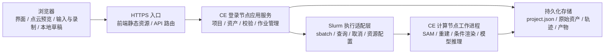
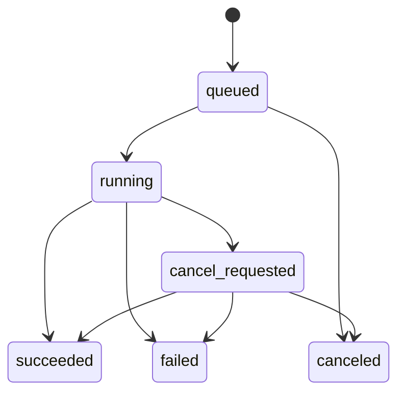

# 浏览器与 CE 集群部署架构 v0.6

日期：2026-09-09。用户已确定 CE 使用 Slurm：后端 HTTP 服务部署于登录节点，推理以 sbatch 调度至计算节点。v0.6 已实现 ENVNAME、脚本配置、提交预览与 API v2 客户端门禁，执行边界和当前验证见 [Slurm 规格](slurm-execution.md)。

新服务必须声明 API v2、匹配的模型版本和 `slurm_sbatch_v1` 执行能力；旧 API v1 只用于历史作业查询／快照导出，不再接受客户端新提交或重试。HTTP 路径沿用既有生成接口，执行语义以 [API v2](slurm-execution.md#api-v2-与兼容性) 为准。CE 服务实现、Slurm 执行器、权重安装与部署仍需另行接入。

本文于 2026-09-05 建立总体架构。除上述客户端外，下文服务划分、项目 API、调度、资产存储和恢复流程仍属需求级设计，不表示已经部署。

生成面板默认连接同源 `/api`，普通使用无需填写地址；覆盖地址的输入框位于折叠的“高级连接设置”。浏览器已保存的非空设置优先于 [.env.example](../.env.example) 的公开 `VITE_CE_API_BASE_URL`，均未设置时使用 `/api`。该值不保存服务端凭据。自定义模型 JSON 只定义前端字段和命令；CE 必须注册相同模型 ID／版本，并负责工作目录、Python 环境、文件检查和 GPU 资源。

**[确定]** 最终应用在浏览器中使用，前后端分离，登录节点承担 API、文件暂存和 Slurm 提交／查询，计算节点运行模型。**[建议]** 下文的服务划分、技术候选和容错策略用于落实这一要求；具体框架、网络入口、共享存储路径和性能预算在部署时核实。初始作业脚本采用用户给定的资源配置，不代表该配置已经在 CE 上提交验证。

相关文档：[软件需求](software-requirements.md)、[交互规格](interaction-spec.md)、[项目格式](project-format.md)、[兼容性调研](research-compatibility.md)、[待决事项](decisions.md)。

## 1. 运行边界

前后端分离指代码、接口和运行职责分离。**[确定]** 页面和 `/api` 共用同一 HTTPS 入口，API 请求路由至登录节点后端，推理由 sbatch 提交至计算节点。具体入口地址、代理所在节点和访问方式需依据 CE 网络规则配置；前端的 `/api` 默认值不代表代理或后端已经部署。调试或特殊部署仍可在高级设置中覆盖地址，详见 [同源连接](slurm-execution.md#同源连接与高级设置)。

| 位置 | 负责的能力 | 数据边界 |
| --- | --- | --- |
| 浏览器 | 2D／3D 主视图、项目／物体／相机／生成四个副面板、SAM 提示交互、WebGL 点云预览、bbox 正面标注、轨迹录制与回放、生成配置及命令编辑 | 当前项目与轨迹保存到浏览器；生成客户端提交 CE 任务。服务端项目与轨迹同步仍待实现 |
| 登录节点应用服务 | 项目创建与注册、上传、资产索引、版本校验、Slurm 提交／查询、作业状态与结果发布 | 保存不可变请求与脚本，以 argv 调用 sbatch；不能直接在登录节点运行内层推理命令 |
| 计算节点 CPU / GPU 工作进程 | SAM 推理、深度或点云重建、点与 mask 关联、预览数据转换、全精度条件渲染、首帧生成、SymphoMotion 导出与推理 | 由 Slurm 分配资源后执行，读取固定输入版本并写入作业输出目录 |
| 持久化存储 | 项目主文件及其资产、预设库、已发布版本、可恢复作业信息 | 不能依赖某个计算节点临时盘长期保存项目 |

浏览器负责低延迟交互；按键、鼠标移动和每个轨迹采样点不需要等待一次远程调用。CE 有 GPU 不代表客户端浏览器无需图形能力：浏览器仍需在本机绘制交互点云。远程逐帧视频串流可作为后续选项，不作为首版交互的既定前提。

## 2. 浏览器三维交互

### 2.1 输入与指针锁定

1. **[建议]** 3D 主视区提供显式“进入控制”操作，在用户手势后请求 Pointer Lock；取得控制前不响应飞行键鼠。首次点击仅取得控制；鼠标左右键不改变平移速度。
2. **[确定]** 运动语义遵循 2026-09-06 修订：平移键松开即停，全部平移方向按相机局部坐标计算，鼠标左右键加减速已取消。
3. **[建议]** Pointer Lock 期间读取相对鼠标位移；使用四元数或等价的完整姿态表示支持全向朝向与横滚，避免仅用固定上下限的普通环绕相机替代。
4. **[建议]** 仅在主视区持有输入控制时拦截右键菜单和相关默认行为。提示词、名称、路径输入框获得焦点后，不处理 WASD、QE、Shift、Control 为运动指令。
5. **[建议]** 退出 Pointer Lock、浏览器失焦或页面进入后台时，清空按键状态并按交互规格暂停录制；暂停保持现场数据。本阶段“继续录制”保持禁用，不因网络或浏览器恢复而自动继续采样。
6. **[建议]** 浏览器或操作系统保留的组合键无法只靠产品约定保证全部覆盖；在目标桌面浏览器上验证 Control 与 WASD 的组合。若某组合无法稳定接管，应提供可配置替代键，并保留用户指定键位为默认需求。
7. **[建议]** Pointer Lock 或 WebGL 不可用时显示具体能力缺失；2D 查看、项目管理和已有轨迹文件操作仍可使用，不能让整页空白。鼠标拖拽等降级控制若改变录制手感，应另行确认。

### 2.2 本地预览与最终数据

- **[确定]** 物体轨迹保存完整 SE(3) 位姿：起点为该物体 bbox 中心，初始朝向来自已确认正面和完整局部坐标系。观察相机与物体代理是不同实体。
- **[确定]** SymphoMotion 相机录制从参考相机起始位姿开始；自由探索位置不自动成为正式录制首点。
- **[确定]** 允许整个场景静止的项目，通过恒定 4D 场景沿相同流程进入相机录制。
- **[建议]** 浏览器对静态点云和各物体局部点集应用当前时间的位姿，实现 4D 预览。后端负责在目标模型要求的精度和采样网格上产生最终点集及条件视频。
- **[建议]** 浏览器渲染坐标与项目世界坐标之间使用显式转换层。仅为画面显示进行的轴向转换不能重新定义项目中保存的世界位姿或物体正面。
- **[建议]** 轨迹控制、采样时间和点云显示质量分开管理。显示帧率下降时不能按弧长重新均速化轨迹；长时间卡顿应暂停并保留已采样部分，不能跨越明显的失控时间段补造录制。

## 3. 项目路径、上传与远程目录

### 3.1 服务端路径与浏览器路径必须区分

项目根目录和预设 assets 根目录属于**服务端环境配置**，与 [项目格式](project-format.md) 使用同一组变量：

| 环境变量 | 用途 |
| --- | --- |
| `DIFFUSIONCONTROL_PROJECTS_ROOT` | 项目文件夹与永久项目资产的根目录 |
| `DIFFUSIONCONTROL_ASSETS_ROOT` | 可复用预设与预览图的根目录 |
| `DIFFUSIONCONTROL_MODEL_ROOT` | 后端模型与权重位置，按执行环境加载 |
| `DIFFUSIONCONTROL_CACHE_ROOT` | 可重建缓存和作业临时文件；不作为永久轨迹的唯一存放位置 |

这些环境变量由应用服务和工作进程读取，不是浏览器本机的环境变量；不能借助前端公开配置暴露服务端凭据。项目路径采用 `PathRef {root: "projects" | "assets", relative_path: "demo_scene/..."}`，服务端通过逻辑 root 解析实际目录。浏览器只需展示逻辑根名称及其允许的相对目录，不依赖服务端实际挂载路径。

**[待定 D08]** 建议创建项目的母目录限定在 `projects` 根内；若选择多根注册，再扩展注册根的 ID、权限和迁移规则。当前两个 PathRef root 不代表已经支持任意多个服务器项目根。

本地电脑上的 `/Users/...`、`C:\\...` 与 CE 上的目录没有天然对应关系。浏览器选择文件或目录不会使 CE 自动获得该路径的访问权。API 返回的短期下载地址也不是项目 JSON 中的永久文件路径。

### 3.2 三种不同入口

| 入口 | 用户操作 | 后端行为 |
| --- | --- | --- |
| 在 CE 创建项目 | 填写项目名称，选择允许的服务端项目根目录和母目录 | 在目标位置创建项目文件夹与初始 JSON；首帧、几何、轨迹等可为空 |
| 从本机上传项目或母目录 | 用浏览器文件／目录选择器选择本机文件，确认目标服务端母目录 | 上传并保留必要目录结构；校验 JSON 与引用，按目标根目录约定重写迁移后的路径；通过后登记项目列表 |
| 注册 CE 已有项目或母目录 | 选择服务端已有目录，发起导入／扫描 | 在已配置可访问根目录内扫描和校验，无需重复上传同一批文件 |

**[建议]** 页面将两种“导入”明确标为“上传本机项目”和“添加服务器目录”。目录选择能力不足的浏览器，可提供项目压缩包上传入口；解包遵循相同路径校验规则。

**[建议]** 文件上传使用分块、校验和及重试机制。上传完成前文件处于暂存区，不能把部分文件注册为有效首帧、轨迹或点云。母目录扫描默认仅检查直接子目录，递归作为显式选项。导入逐项目报告成功与失败，一个损坏 JSON 不应阻止其他完整项目导入。只处理项目声明需要的资产和明确支持的导入内容，避免把本机母目录中无关文件全部上传。

**[建议]** 引入浏览器本机文件时默认复制到 CE 的项目目录或预设库。已在 CE 的文件可按后续存储策略复制或登记引用，但项目可迁移性及依赖位置必须明确。若引用超出允许根目录、包含目录穿越或符号链接最终逃逸，则拒绝并指出具体字段。

### 3.3 主数据与服务索引

- **[建议]** `project.json` 和其引用的持久化资产构成可导出、可重新导入的项目主数据；数据库可保存项目列表索引、权限、作业队列和搜索信息。两者不能各自成为不同的项目真相。
- **[建议]** 所有正式变更通过应用服务提交，由其校验、原子更新项目引用并刷新索引。计算工作进程不直接并发修改同一个 `project.json`。
- **[建议]** 浏览器持有项目 `revision`。保存时附带预期版本；如果另一标签页或用户已修改，服务返回冲突，并保留当前草稿供重新加载、比较或另存，不能静默覆盖。
- **[建议]** 预览 URL、作业日志 URL、上传会话和浏览器缓存属于应用运行数据；永久资产路径、hash、格式与来源版本属于项目数据。

## 4. 异步计算与 CE 执行适配层

### 4.1 作业类型与请求结果

耗时能力以异步作业提交，至少覆盖首帧生成、SAM 推理、3D 重建、mask 到点云关联、预览数据准备、4D 缓存生成、轨迹预览图、模型条件导出和模型推理。纯粹的元数据编辑无需排 GPU 队列；可立即完成的小规模点索引或变换计算也不应强制申请 GPU。

提交接口快速返回 `job_id`，不等待模型计算完成。界面持续显示：排队／运行、当前阶段、可用时的进度、开始时间、错误摘要以及取消／重试入口。预计剩余时间只有在具有可信依据时显示，不能用固定倒计时伪装真实进度。

Slurm 的 sbatch 成功返回表示作业已提交并取得 ID，不能据此显示推理完成；资源可能仍在排队。服务端可使用 `--parsable` 获取调度 ID，以 `--chdir` 明确模型工作目录，并记录实际提交参数。[Slurm 官方 sbatch 文档](https://slurm.schedmd.com/sbatch.html)

SAM 的点击或框选应携带图像资产版本、正负点／框坐标及缩放映射。建议复用与该图像版本绑定的推理会话或特征缓存；新点击的请求返回顺序即使与发起顺序不同，也只能展示当前有效请求的 mask。未确认的候选 mask 不自动替换正式对象。

### 4.2 作业状态

| 状态／动作 | 需求 |
| --- | --- |
| queued | 已接受且持久化，等待所需资源；浏览器关闭不撤销已提交作业 |
| running | 已取得执行资源；记录执行器作业标识、阶段和心跳 |
| cancel_requested | 已收到取消请求，但尚未确认实际停止；不能直接宣称资源已释放 |
| canceled | 未执行或已确认停止；临时输出不会自动成为当前项目资产 |
| succeeded | 工作进程完成且输出校验通过；不等同于已绑定为当前项目版本 |
| failed | 保存错误类别、可读摘要和诊断日志引用；旧有效资产继续保留 |
| 重试 | 用户主动重试创建关联的新作业，记录 `retry_of`；重试本身不覆盖旧输出 |
| 网络重复提交 | 同一幂等键返回原作业，不因请求重发重复占用 GPU |

取消与完成可能同时发生。实际已完成时允许显示 succeeded，但发布结果前仍需检查取消意图和输入版本；未经确认的结果保留为历史产物或待应用结果，不自动覆盖当前项目。

### 4.3 版本、发布和恢复

每个作业至少记录：项目 ID、输入资产 ID／版本／hash、项目版本、参数、执行后端、代码与模型版本、资源请求、创建／开始／结束时间、输出资产清单，以及错误或取消信息。模型权重标识使用可追溯的版本信息，不保存到浏览器可见日志中的凭据。

作业输出先写入独立暂存目录，经完整性和语义校验后原子发布为不可变资产版本，再更新项目引用。任务排队或运行期间若首帧、mask、轨迹等依赖改变，旧作业即使成功也不能把新项目标为 ready；应显示“结果基于旧版本”，由依赖校验决定可否重新应用。

应用服务重启后应恢复作业记录并与 CE 执行器对账。不能仅因浏览器断线就判定作业失败，也不能仅因任务日志暂时没有输出就判定完成。计算节点失联时先显示执行状态待确认，经执行器确认再归类为失败、取消或成功。

### 4.4 CE 部署配置

登录节点和 Slurm 已确定，实际部署仍需落实以下环境信息：

- 前端与 API 的可访问入口，以及浏览器到 CE 的连接方式。
- 登录节点服务的启动配置，以及计算节点到应用服务／共享存储的访问方式。
- Slurm 命令路径、状态查询与取消权限，以及给定分区和配额在执行账户下的可用性。
- GPU 类型、显存、配额、并发限制，以及模型环境与权重的可用位置。
- 项目和 assets 的持久化根目录；临时盘、共享盘或对象存储的实际能力。

**[建议]** 用 `submit / status / cancel / collect_outputs` 接口封装 Slurm 操作，浏览器只依赖应用 API，不掌握集群登录凭据。互动分割与长时间视频生成可使用不同资源配置，具体取决于 CE 支持的能力。

## 5. API 粗边界

生成能力已有 [API v2 契约](slurm-execution.md#api-v2-与兼容性)；下表其他能力仍是职责示例，不代表已实现端点或 OpenAPI 契约。前端仅依赖应用 API；上游模型的工作目录与运行环境由适配器管理。

| 能力域 | 典型操作 | 关键约束 |
| --- | --- | --- |
| 运行能力 | 查询版本、可用功能、配置根目录、输入限制 | 后端暂不可用与资产缺失分别展示 |
| Projects | 列表、创建、读取、保存、注册服务器目录、扫描母目录 | 使用项目 ID、根目录 ID 和 revision；路径由服务端解析 |
| Uploads | 创建上传会话、上传分块、查询已上传部分、校验完成 | 上传进度与模型作业进度分开；校验前不发布资产 |
| Assets | 元数据、缩略图、点云层级索引、分块读取、下载 | 用资产 ID 解析受控文件访问，支持缓存与需要时的范围读取 |
| Objects | mask 候选／确认、名称和提示词、点归属、bbox、正面 | 保存来源图与几何版本；确认后触发依赖失效检查 |
| Trajectories | 创建录制会话、分块保存、完成校验、读取、导入预设、应用版本 | 支持幂等、时间戳、SE(3)、目标 ID 和源场景版本 |
| Presets | 列表、导入、预览、复制到项目、保存历史轨迹为预设 | 原预设不可因项目重定位而被覆盖 |
| Jobs | 提交、状态、事件、取消、重试、结果和日志摘要 | 提交资源消耗型作业后返回 job_id；按输入版本发布 |
| Export | 校验目标能力、构建条件包、读取报告与下载产物 | 服务端重算／校验完整条件，不以浏览器画面为模型输入依据 |

**[建议]** 普通读写使用 HTTP API；任务进度可使用 SSE，断线后按事件序号恢复并以轮询兜底。只有需要双向持续消息时再增加 WebSocket，不能把每帧飞行输入放入远程消息链路。

接口错误应有稳定错误码、可读原因、关联项目／资产／字段，以及可重试标识。下载地址失效只需刷新访问地址，不得把仍存在的永久资产标为丢失。

## 6. 点云与 4D 资源分级加载

1. **项目列表阶段：**只读取元数据、首帧缩略图和状态，不批量加载所有项目的几何。
2. **2D 阶段：**加载选中项目首帧与所需 mask；视图不需要点云时不主动占用点云显存。
3. **3D 阶段：**先加载包围范围、相机信息和低精度点云，再根据设备能力、视野与点数预算加载更细分块。显示加载进度，允许取消不再需要的请求。
4. **4D 阶段：**优先加载静态点集、对象归属／局部点及变换序列，在浏览器按时间求值；需要逐帧缓存时只预取当前播放窗口，避免把整段全精度 4D 点云同时放入内存。
5. **切换与回收：**项目切换时取消过时请求并释放不再使用的 GPU 资源。缓存按资产 hash／版本区分，不得在新项目显示旧项目的迟到数据。

**[建议]** 服务端保留原始全精度几何，并生成独立预览层级。预览点数、压缩或量化精度不能悄悄改变 bbox 中心、轨迹坐标、mask 对应或最终模型采样点。若预览点承担选中交互，应保留到原始点 ID／对象 ID 的映射；无法精确映射时由服务端完成精确查询。

**[建议]** 预设图、轨迹线和已下载的时间变换数据优先保留，保证大型几何尚未加载完成时仍可查看已有工作。相机录制开始前，必须确认本次时长需要的预览数据可用；因数据不足无法稳定显示动态场景时显示等待状态。

性能验收应在实际客户端与网络上固定测试场景、点数、对象数、轨迹时长、首屏等待、交互帧率、峰值内存和传输量。当前不承诺任何未经测量的千万级点云实时帧率或固定加载秒数。

## 7. 网络中断与录制持久化

录制状态与同步状态是两个维度。`recording / paused / finalizing` 继续遵循交互规格；同步状态可为 `local_only / syncing / synced / sync_error`，避免把“轨迹结束”和“服务端已经保存”混成一个动作。

### 7.1 正常链路

1. 进入录制前创建浏览器草稿，绑定项目 ID、目标 ID、几何／4D 版本、参考相机、时间轴和控制配置。建议采用 IndexedDB 存储草稿及采样分块；实时计算仍在浏览器内完成。
2. 每个分块携带录制会话 ID、递增序号、起止采样时间及校验信息，按批次持久化到本地；联网时异步上传。服务端确认前保留本地副本。
3. 暂停后用户点击“结束录制”，浏览器冻结样本清单并完成上传。服务端检查序号连续性、首点、时间戳、有限数值、SE(3)、版本和目标约束，通过后生成正式轨迹资产并更新项目引用。
4. 轨迹正式保存后生成独立预览图；图像生成失败只影响预览状态。浏览器可以先展示临时预览，但正式 PNG 的持久化位置仍应进入项目记录。

### 7.2 断线、恢复和异常

- **[建议]** 网络中断但本次录制所需几何已加载、本地持久化正常时，可继续当前录制；显示“正在本机保存，等待同步”。不能显示服务端保存成功。
- **[建议]** 若录制所需 4D 数据尚未缓存，或本地写入失败／空间不足，应暂停采样并保留已有内存和可读草稿，提示结束并保存；不能悄悄丢帧后继续显示录制正常。
- **[建议]** 离线结束后进入“已结束，等待同步”，可以预览本地轨迹。网络恢复时从服务端已确认的分块序号续传，重复分块不创建重复轨迹。
- **[建议]** 页面重载后检查未同步草稿，允许恢复为已暂停或已结束数据，完成保存或导出备份；**不实现继续录制**，也不把网页关闭期间算入有效轨迹时长。
- **[建议]** 浏览器本地草稿仅是恢复措施，受存储额度、用户清理及浏览器策略影响；应尽早同步。关闭页面前有未确认数据时显示明确未同步状态，并提供轨迹文件下载作为备份。
- **[建议]** 重连后若服务端项目版本已经变化，仍接收轨迹作为历史或待重绑定资产，显示版本冲突；不能自动绑定到新场景并标为 ready。
- **[建议]** 客户端分块写入周期决定崩溃时可能丢失的最后一小段，界面只对已确认持久化的范围宣称已保存。写入周期与缓冲上限应在实施验证中确定。

## 8. 必要的访问边界

**[建议]** 通过 CE 既有身份入口或应用会话识别用户；项目和资产接口检查相应的读写权限，作业查询与取消检查所属项目权限。单用户部署可保持简单，无需先建设企业权限系统。

**[建议]** 后端只访问已配置的项目与 assets 根目录；不能把任意服务器绝对路径读取、任意命令执行或集群凭据下发给浏览器作为目录选择方案。工作进程取得完成当前作业所需的输入、输出目录和资源；用户只需看到可读作业错误，不需看到服务端密钥。

这些边界用于保证共享 CE 环境中的项目与作业不会误关联，不新增用户每次保存或提交计算都要人工审批的流程。

## 9. 技术候选与未定选型

| 层 | 推荐候选 | 选择依据与边界 |
| --- | --- | --- |
| 前端 | TypeScript + React，Three.js 或等价 WebGL 渲染层 | 便于状态机、面板及三维控制组织；具体版本及浏览器兼容性实施时核实 |
| 浏览器草稿 | IndexedDB；Web Worker 承担适合迁移的解析／缓冲计算 | 避免大文件解析长时间阻塞输入；线程与传输开销需实测 |
| API | Python Web 框架，例如 FastAPI | 便于连接 SAM、重建和模型工具；长推理必须移出 API 请求进程 |
| 作业执行 | 应用作业记录 + Slurm 执行器适配层 | 登录节点提交 sbatch，计算节点运行模型；按请求 ID 去重并查询调度状态 |
| 项目存储 | 持久化目录 + JSON／资产；数据库维护索引和作业信息 | 保持项目可迁移；并发规模和 CE 存储条件决定数据库部署形式 |
| 预览资产 | 点云分块与层级索引、静态点集 + 对象 SE(3) 时间序列 | 优先降低传输和浏览器内存；最终格式通过真实数据测试确定 |

Slurm 与登录节点部署位置已经确定，表中的框架和存储实现仍为候选；没有因此完成服务部署。依赖版本和渲染格式将在实施时依据 CE 环境与兼容性要求核实。

## 10. 架构验收补充

| 编号 | 场景与预期结果 |
| --- | --- |
| DA01 | 浏览器上传本机项目后，关闭本机源目录仍能在 CE 重新打开；JSON 不依赖本机绝对路径 |
| DA02 | 注册 CE 母目录只扫描允许范围；目录中一个坏项目产生单独错误，其余项目可用 |
| DA03 | 高延迟网络下键鼠转向和速度积分不逐次等待服务端，已有点云仍可交互 |
| DA04 | 输入提示词、退出 Pointer Lock、切出浏览器不会产生幽灵按键；录制退出控制后进入暂停 |
| DA05 | 连续提交两次相同幂等请求只创建一个计算作业；主动重试则产生可追踪的新作业 |
| DA06 | 作业排队时修改首帧或轨迹，旧结果完成后不会覆盖当前项目或误标 ready |
| DA07 | 点击取消后先显示取消请求中，只有执行器确认后才显示已取消；临时输出不会污染当前项目 |
| DA08 | 应用服务重启后仍可查询运行中的 CE 作业，完成的有效结果能被重新发现和校验 |
| DA09 | 只打开 2D 时不下载全部 3D / 4D；切换项目后迟到点云不会显示到错误项目 |
| DA10 | 下调点云预览精度不会改变已保存 bbox、物体起点、相机首点或导出点轨迹 |
| DA11 | 录制时断网、暂停并结束，轨迹显示待同步；重连只补传缺失分块，最终没有重复采样 |
| DA12 | 页面重载后恢复未同步草稿，可结束保存或下载备份，继续录制按钮仍禁用 |
| DA13 | 两个标签页保存同一旧 revision 时能识别冲突并保留后提交草稿，不静默覆盖 |
| DA14 | 服务端轨迹保存成功但 PNG 任务失败，轨迹仍有效，预览可独立重试 |
| DA15 | 全静态 4D 项目可进入相机录制；正式第一位姿必须为已保存参考相机位姿 |
