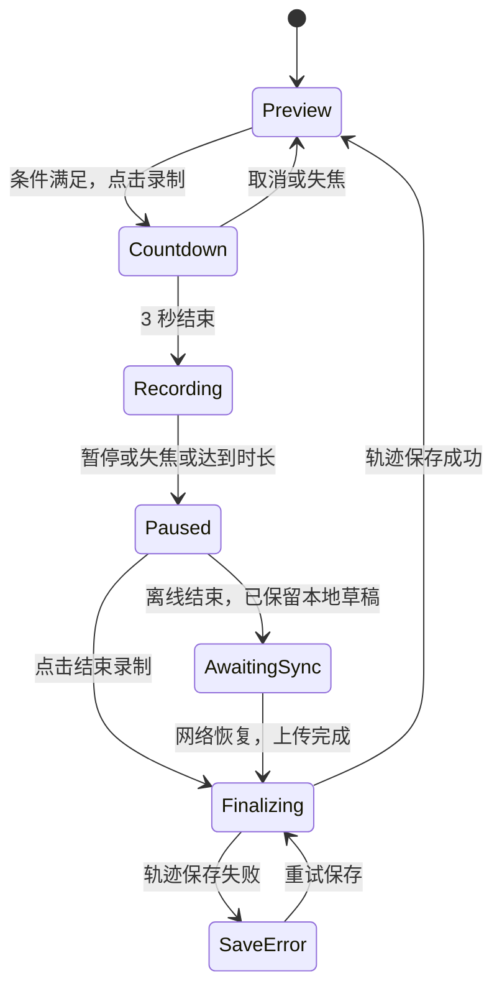

# 交互规格与状态机 v0.4

日期：2026-09-06。用户最新修改覆盖原 D01／D02 的速度保持和鼠标加减速要求，并确定相机局部升降。D17-A、D18-B、D19-A 已确认，见 [决策清单](decisions.md)。

## 1. 视图、目标与模式

三个独立状态共同决定当前操作：

| 状态维度 | 值 | 含义 |
| --- | --- | --- |
| View | 2D / 3D | 当前面板；4D 是动态数据状态 |
| Observer | free / follow_camera | 自由观察或按拍摄相机轨迹回放 |
| Target | none / object_id / camera | 本次拟录制的目标 |
| Interaction | preview / countdown / recording / paused / finalizing / awaiting_sync / save_error | 探索、准备、采集和保存阶段 |

默认 `preview`。在同一 3D 视口探索静态或时变场景，按下播放后全部物体按并行轨道求值。点击 object control 的“录制添加”先选目标并打开 3D，点击 camera control 的“录制”先检查 4D 就绪，仍打开 3D。拟录制目标与受控对象分离：这一步不准备／激活物体控制器，不切换观察位姿。用户此时点击“进入视角控制”仍只自由观察；点击主视区录制键才准备目标的起始状态。

“绘制模式”对应一次从倒计时到结束处理的录制会话，不是另一套视图。2D 不接受三维运动录制。

## 2. 键鼠规则（替代持续飞行）

| 输入 | 行为 |
| --- | --- |
| W / S | 当前控制相机局部 +Z / −Z，即前／后 |
| A / D | 当前控制相机局部 −X / +X，即左／右 |
| Shift / Control | 当前控制相机局部 −Y / +Y，即上／下；随俯仰和横滚变化 |
| 松开平移键 | 对应分量立即归零；全部松开或抵消时停止平移 |
| 鼠标移动 | 独立偏航／俯仰，俯仰限制 ±89°；由正交旋转合成为四元数，不累积主动横滚 |
| Q / E | 绕相机局部光轴横滚，角速度独立 |
| 鼠标左／右键 | 取消加减速；普通 UI 点击、分割和 bbox 面选择按各工具规则处理 |
| 鼠标滚轮 | 受控平移时上滚加快、下滚变慢；具体作用范围见 D23 |
| P / 录制暂停按钮 | 同时暂停采样和场景时钟 |
| Esc | 释放 Pointer Lock；录制中暂停，倒计时中取消 |
| Space | 附加急停／清空运动输入；普通松键已能停止 |

平移速度在设置面板用 `move_speed` 明确设置，单位为 scene_unit/s；v0.4 增加滚轮修改该速率，范围与比例规则见 [滚轮调速](changes-v0.4.md#滚轮调速)。保留独立 `roll_speed`、`look_sensitivity`。旧鼠标按钮加减速度与惯性配置不再使用；滚轮调节的上下界只约束设定速率。没有公制标定时不显示 m/s。

D23 暂采用所有受控平移共用滚轮速率：自由观察、相机录制和物体录制。仅 Pointer Lock 生效且处于可移动状态时消费滚轮；2D、未进入控制、暂停／倒计时、跟随回放和输入框不消费。Ctrl／Meta 滚轮保留浏览器操作。上滚一个标准单位乘 1.2，下滚除以 1.2，范围 0.01–8 su/s，默认 0.35 su/s。设置面板与 HUD 同步；HUD 实际速率只表示当前键鼠平移，拍摄相机的回放速率继续由轨迹求值。

```text
camera_local = [D-A, Control-Shift, W-S]
if length(camera_local) == 0:
    velocity_world = [0, 0, 0]
else:
    velocity_world = R_world_camera * normalize(camera_local) * move_speed
position_world += velocity_world * dt
```

必须把升降并入局部向量再乘旋转矩阵，不在世界 Y 上追加升降。W+D 等组合归一，反向键相互抵消；持键时转头会改变移动方向。松键后转头只旋转，不平移。单调时间积分，不按渲染帧次增加固定距离。

**D18-B 已确认：**仅实际物体录制会话使用绑定物体朝向的虚拟控制相机：W 沿物体 +X，D 沿物体 −Y，Shift 沿物体 +Z；观察相机仅用于查看。普通探索及相机录制使用当前受控相机局部轴。物体初点和旋转保存规则保持 D04，不写入观察相机偏移。

偏航／俯仰／横滚独立保存为控制器状态，Q/E 只改变横滚量，鼠标不修改它。普通探索的俯仰相对场景参考坐标；物体录制相对初始虚拟相机基准，因此即使正面为世界上下方向，首个样本仍精确匹配物体初态。改变观察方式或准备新目标时同步控制器角度，不能携带另一对象的姿态状态。

场景提供“进入视角控制”按钮请求 Pointer Lock；开始录制也在用户点击时请求，成功后才倒计时。普通面板、输入框和时间轴不驱动场景；编辑轨道前退出指针捕获。录制中 P 暂停后释放鼠标，才可点击结束。

窗口失焦／Pointer Lock 丢失时清空按键、停止移动；倒计时取消，录制暂停。重新聚焦不会沿旧方向移动。鼠标右键菜单只在捕获控制时屏蔽。指针捕获的浏览器约束见 [MDN](https://developer.mozilla.org/en-US/docs/Web/API/Element/requestPointerLock)。

### 2.1 物体中心参考轴

D22 暂采用 bbox 参考系：原点为当前 bbox 中心，六向轴与卡片六面同色，初始与 bbox 轴对齐；运动时按 `R(t) R(0)⁻¹` 转动。选择正面只重定义物体控制坐标的 +X，不更改 bbox 六面名称。各对象显示六向箭头，选中对象显示紧凑轴名；投影接近重叠时引线连接错开的标签与轴端。正面长箭头独立提示所选面。关闭包围盒开关时同时隐藏轴、文字和引线；2D 首帧和 mask 不包含这些叠加内容。

## 3. 录制状态机



本版本**没有 Paused → Recording 转移**。

| 状态 | 用户看到的模式 | 录制按钮文字／可用性 | 暂停按钮文字／可用性 | 数据与视角行为 |
| --- | --- | --- | --- | --- |
| Preview | 预览 | 开始录制；条件满足才可点 | 暂停录制；禁用 | 可探索或回放，不写轨迹 |
| Countdown | 绘制，3/2/1 | 倒计时；禁用 | 暂停录制；禁用 | 固定起始状态，不采样、不推进 4D |
| Recording | 绘制，红色录制指示 | 录制中；禁用 | 暂停录制；启用 | 按有效时间采样位姿，同步 4D |
| Paused | 绘制，已暂停 | 结束录制；启用 | 继续录制；**禁用，标注暂未开放** | 冻结采集数据和 4D，可结束 |
| Finalizing | 保存中 | 保存中；禁用 | 继续录制；禁用 | 冻结结果，保存轨迹、生成预览 |
| AwaitingSync | 本地预览，等待同步 | 等待同步；禁用 | 继续录制；禁用 | 会话已结束，可回放本地结果；未宣称服务端保存成功 |
| SaveError | 待保存 | 重试保存；启用 | 继续录制；禁用 | 保留会话及临时数据，显示错误 |

用户原文“录制按钮在开始／结束之间切换”的概括，以其后明确的规则为准：录制进行中不能直接结束，必须先暂停再结束。

### 3.1 开始与倒计时

1. 校验目标与对应几何、正面、4D、时间轴等条件。
2. 用于 SymphoMotion 的相机录制先恢复参考相机的位置、旋转和 K（D05-B）；物体使用中心对齐的控制器位姿。随后捕获起始位姿、初始运动状态和控制参数快照。
3. 点击开始录制取得指针捕获后倒数 3 秒。建议锁定起点、方向输入和场景时间；倒计时不混入轨迹，也不让相机在倒计时期间漂走。
4. 倒计时结束写入 `t=0` 样本并开始采集。物体在中心、相机在参考位姿静止起录；只有当前有效方向输入才产生平移，不恢复历史飞行速度。
5. SymphoMotion 录制首个相机样本必须匹配参考相机。自由探索保持开放，但首版不把任意探索起点直接写成兼容轨迹，也不默认做相对重定位。

### 3.2 暂停与结束

暂停瞬间写入最后一个有效样本（若尚未存在同时间戳样本），冻结记录时间、受控位姿和 4D 时钟，释放指针。暂停十秒不会让最终轨迹延长十秒。

建议暂停状态允许用独立 observer 检查场景，但录制目标位置、4D 时间和结果不可修改。结束后返回预览模式，保留刚录制轨迹为当前选择并自动保存；自由观察相机恢复独立控制。新轨迹与新预览图同步替换卡片数据；放大图引用当前轨迹 ID／版本，不能保留结束前的对象快照。

保存顺序：会话临时数据 → 校验与轨迹正式文件 → 原子更新 JSON 引用 → 独立预览图 → 更新预览状态。轨迹保存失败不返回一个“已保存”的预览状态；预览图失败可以返回预览并明确待重试。少于两个有效不同时间样本时提示录制过短，保留会话供用户选择保留为静止姿态或丢弃，不伪装成完整运动。

浏览器本地采样与服务器同步分开计状态：`local_only / syncing / synced / sync_error`。离线结束后可进入 `awaiting_sync` 查看本地结果，恢复网络后上传保存；不因此开放“继续录制”。刷新页面只允许恢复草稿为已暂停／已结束状态。正式“已保存”以 CE 后端持久化确认为准，详见 [网络与持久化](deployment-architecture.md#7-网络中断与录制持久化)。

录制／暂停／保存中不允许直接换项目、换目标、替换首帧或更改上游几何。建议界面引导先暂停并结束；有未保存数据时保留恢复入口。允许取消倒计时，首版不增加未授权的恢复录制功能。

## 4. 物体录制与局部坐标

开始录制前必须确认 2D mask → 3D 点归属 → bbox → 正面。正面所定义的是物体的局部 +X，和相机的局部前方 +Z 不是同一个约定；转换由控制器完成。

**[确定 D04-A]** 记录完整刚体位姿：受控物体代理原点置于 bbox 初始中心，对象坐标仍为 +X 正面、+Z 上方；移动输入使用 D18 所选相机基，观察视角跟随显示，可建议增加独立观察选项。记录的是物体代理的世界变换，不是带跟随偏移的观察相机变换。

- `object_position(0) = bbox.center_world`。
- `object_rotation(0) = object.initial_pose.rotation`，由正面和上方向共同决定。
- 对象局部轴用于定义和保存对象旋转；按 D18-B 将对象 +X 前、−Y 右、+Z 上映射到虚拟相机 +Z 前、+X 右、−Y 上，再统一计算平移。
- 如需由相机样式的控制姿态转换，使用 `R_object = R_rig * A`，其中 A 的列为 rig 坐标中的对象 +X、+Y、+Z，即 `[forward, -right, up]`；初始时反算 rig，使记录 t=0 姿态严格匹配物体初态。
- 物体轨迹预览必须显示中心路径、时间刻度、首尾点与朝向，不只显示观察相机飞过的路线。

导入预设时先重锚定首点和初态，再预览；手动调整 bbox 或正面使原轨迹绑定过期，不悄悄平移现有轨迹。

## 5. 并行时间轴与动态场景同步

时间以秒保存。输出 profile 采样 `t_i=i/fps`，末帧时刻为 `(F-1)/fps`；`F/fps` 是视频容器展示时长。源录制样本时间、项目全局时间和输出帧率是三个不同概念。

每个物体一行，相机一行；每行标签显示名称和状态。运动片段按实际开始与结束定位；静止行贯穿整个项目且标“静止”，未赋运动行显示缺失状态。共享尺标、片段和播放指针使用同一内容区域，指针线不捕获轨道拖动事件。

**D19-A 已确认：**源 `samples` 和源时长 `D_s` 不随编辑改变。轨道片段保存 `start=S`、`duration=D_c`，在全局时间 `t` 取：

```text
source_time = clamp((t-S) * D_s / D_c, 0, D_s)
playback_rate = D_s / D_c
```

位置按源时间线性插值，旋转 slerp，禁止按路径弧长强制匀速。轨道外保持首／末位姿，速率为零。片段内的源速度和角速度乘 `playback_rate`；例如 4 秒运动压到 2 秒为 2×，路径与旋转不变，原有停顿按相同比例缩短。本轮不增加内部变速点。

| 操作 | 时间行为 |
| --- | --- |
| 拖动片段正文 | 移动 S，D_c 不变，不推动其他轨道 |
| 拖动左边界 | 结束时刻固定，修改 S 与 D_c；重新定时整段而非裁掉开头 |
| 拖动右边界 | S 固定，修改 D_c；重新定时整段而非裁掉结尾 |
| 数值输入／方向键微调 | 与拖动走同一校验、求值和保存路径 |
| 拖动尺标／空白轨道 | 只改变当前播放时刻，不改变片段 |
| 点击播放 | 从当前时刻推进全部物体和相机；末端按播放重回起点 |
| 自由观察／跟随相机 | 只换观察方式，不改变时间、物体姿态或轨迹数据 |

建议片段最短为一个输出帧间隔；默认按帧吸附，数值显示秒；编辑前停止播放，录制状态下禁用时序编辑。项目默认 5 秒，可显式延长；现有片段不能被缩短项目时长暗中裁掉。相机从参考姿态延迟开始前保持参考姿态，仍满足首帧位姿；时间编辑后需要重新检查联合投影。

3D 预览始终求值全部物体的编辑时间映射，不仅求值当前选中对象。动态构建 ready/stale 是用于相机录制和后端产物的状态，不是另一个视图。物体几何或时序变化后可在 3D 即时看修改，动态缓存标过期；确认重新构建后开放相机录制。相机轨道的时间编辑不改变物体点云；其自身预览和导出需要更新。

相机录制仍从场景 `t=0` 与参考相机起录，倒计时冻结场景；录制时全部物体使用全局录制时间求值，暂停冻结场景与样本。初次保存片段为 `start=0, duration=源录制时长`，之后再在时间轴编排。

## 6. 三维轨迹图与镜头模型

PNG 与交互 3D 回放使用相同位姿、时间映射和镜头模型。预览图使用固定斜视角的三维坐标系，明确 X/Y/Z、scene_unit、首末时间；物体显示中心曲线与朝向，相机显示曲线、等时间标记、光轴和稀疏视锥。

- 颜色表示当前编排后的平移速率，必须有 su/s 数值图例；显示 t 与平移／旋转角速度，原地旋转不能仅有一个点。
- 光轴取 `R*[0,0,1]`，不以平移切线替代；视锥取像素边界经 K 反投影的射线再变换到世界系。视锥展示深度仅用于可读性，不是焦距或真实 far clipping 距离。
- 镜头信息含尺寸、K、水平／垂直 FOV、distortion.model、系数和来源。K 是权威值；FOV 是派生值，离轴主点按两边光线角度计算，不能只套对称镜头公式。
- 畸变采用明确模型，建议 Brown–Conrady `[k1,k2,p1,p2,k3]`；零畸变与未知标定分别记录。图中附理想与畸变网格，交互视口显示受畸变影响的边缘射线；跟随画面若支持畸变应使用相同投影，不得只改标签。
- **D17-A 已确认：**每条轨迹固定镜头配置，可编辑和预览；本轮不增加随时间变化的镜头轨道。修改输出镜头不改重建参考标定；若与首帧参考 K 不匹配或使用非零畸变，应明确为待适配草稿，不能宣称现有 SymphoMotion 可直接读取。
- 自由观察相机的投影仅服务导航；跟随相机的实际画幅使用记录的尺寸比例和 K，窗口调整不改变拍摄 FOV。两种观察模式下都显示目标轨迹速度，另标导航速度。

预览是派生资产，源轨迹、片段时间映射或镜头修改后必须重新生成，不能在新 JSON 上挂旧速率图。导出 JSON 保留原始轨迹及时间绑定，后端按全局输出网格重采样，详见 [项目格式](project-format.md)。

## 7. 调研依据

时间和相机图示的论文／源码核查及本系统新增设计见 [调研补充](trajectory-camera-research.md)。CameraCtrl 的视锥图是参考方法，不代表它已经实现本项目的速度色标或 Brown–Conrady 畸变预览；这两者是本系统明确增加的编辑器功能。

## 8. 界面偏好与人物实例

浅／深主题只改变编辑器界面；按钮表明当前模式与切换动作。初始跟随系统偏好，手动选择持久化；轨迹颜色、参考图和导出的学术 PNG 不受主题影响。

每张物体卡片以独立开关控制展开，可全部收起；卡片选中仅改变场景高亮与操作目标，不能作为展开条件。点击卡片标题切换展开，展开时可同时选中该对象；折叠时保留场景选择。输入提示词、录制和轨迹替换不连带折叠其他卡片。

人物为一个刚体对象；球头、方块躯干及四肢共享对象 ID、mask、点云索引、中心、正面和轨迹。示例人物默认已分割并静止，正面仍需用户确认。示例更新后参考图与 mask 必须由同一版几何重绘；不修改外部导入的真实图像。
