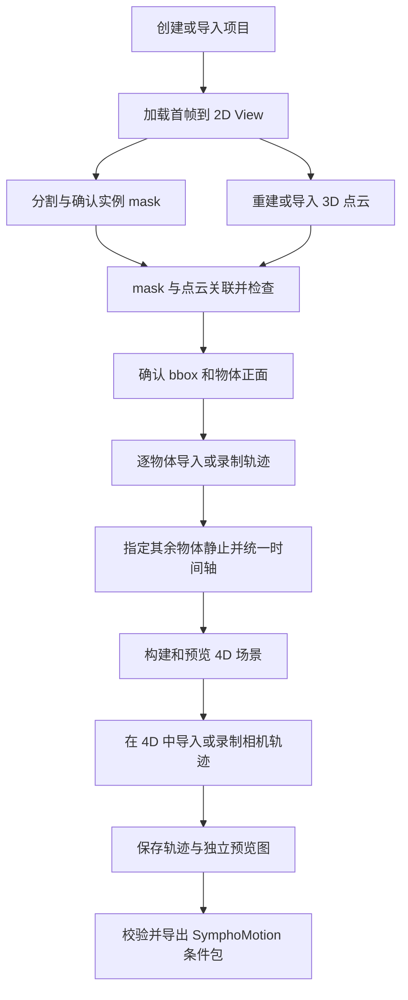

# 软件需求规格 v0.4

状态：2026-09-06，已按先文档、后代码的顺序实现 v0.4。D22／D23 已询问，当前采用标注的推荐方案，尚未视为用户确认；实际验证范围见 [本轮记录](changes-v0.4.md)。D17–D21 保持有效，真实计算服务仍未接入。

本文使用三个标记：**[确定]** 为用户明确要求；**[建议]** 为补齐操作闭环的设计；**[待定 Dxx]** 对应 [决策清单](decisions.md)。上游事实以 [兼容性调研](research-compatibility.md) 为准。

## 本轮 v0.4 修订要求

1. **[确定]** 物体 bbox 中心显示参考坐标轴，与 object-card 采用同一套轴向配色；物体录制与回放时同步更新。具体参考系见 D22。
2. **[确定]** 鼠标滚轮上滚加快、下滚减慢受控平移；松键停止和相机局部方向保持有效，鼠标按钮仍不调速。正式物体录制是否采用滚轮调速见 D23。

交互规范与实际验证见 [v0.4 修订记录](changes-v0.4.md)。

## 本轮 v0.3 修订要求

1. **[确定]** 页眉提供浅色／深色切换，两种模式保持学术工具风格，覆盖面板、时间轴、表单、弹窗和视口文字叠层。**[建议]** 初次读取系统偏好，用户选择保存到浏览器设置；主题不改变参考图、场景材质、镜头或导出的 PNG。
2. **[确定]** 每个 object-card 独立展开／折叠，允许全部收起和同时展开多个。展开状态与场景选中对象分离；选中对象不强制展开，折叠不丢失选中状态或提示词。展开状态属于界面偏好，不写入轨迹数据。
3. **[确定]** 结束物体录制后，当前轨迹、时间片段和新生成的缩略图必须作为同一版本更新；卡片、放大图、下载和刷新后结果一致。生成失败需明确提示，不得沿用旧图冒充新结果；历史轨迹保持可复用。
4. **[确定]** 物体卡片“录制”只选择拟录制目标并打开 3D。此时继续处于预览；“进入视角控制”只操作自由观察相机，不能移动物体或切到物体绑定视角。只有点击主视区“开始录制”后，才将物体控制器置于 bbox 中心并进入倒计时；倒计时冻结，实际录制时按 D18-B 操作物体。
5. **[确定 D21]** 鼠标偏航／俯仰与 Q/E 主动横滚分开维护；俯仰限制为 ±89°，不因反复鼠标转向或同时平移而产生额外横滚。保持透视投影及正交旋转基，不通过改成正交投影掩盖姿态错误。普通探索以场景参考系为准，物体录制以初始绑定虚拟相机为参考，保留所选正面对应的精确初始姿态。
6. **[确定 D20]** 程序化示例场景增加方块躯干／四肢、球体头部组成的人物，作为一个整体实例，支持整个人物的 mask、点云归属、bbox、正面、提示词和刚体轨迹。初始设为静止，可改为运动；不增加骨骼动画。已有程序化示例应能升级看到人物，同时保留既有对象 ID、提示词、轨迹和镜头；外部导入图像／项目不自动插入人物。

本轮实现及验证范围见 [v0.3 修订记录](changes-v0.3.md)。

## 1. 产品目标与边界

用户从首帧参考图像出发，在可交互的三维点云空间中设计物体与相机运动。系统把图像、mask、几何、提示词、时间和轨迹保存在可重开、可复用的项目中，并为 SymphoMotion 准备一致的条件数据。

- **[确定]** 重点兼容 SymphoMotion 的三维空间、相机轨迹和物体轨迹注入方式，参考 ViewCrafter 的点云重建与重渲染思路、Uni3C 的几何条件控制思路。
- **[确定]** 最终应用在浏览器中实现，前后端分离，服务端部署于有算力的 CE 集群。浏览器即时处理键鼠与轨迹采样，CE 处理模型任务及长期保存，详见 [部署架构](deployment-architecture.md)。
- **[建议]** 编辑器保存自身明确版本的场景和轨迹数据，通过独立适配器导出上游输入包；不得把自定义 JSON、PLY 或 4D manifest 声称为上游可直接读取的格式。
- **[确定 D04-A]** 物体录制包含平移与旋转。**[建议]** 首版以刚体点云表达；骨骼动画、非刚体形变、碰撞与物理仿真、自动恢复遮挡面的完整几何不列入已承诺功能。
- **[确定]** 首帧支持外部导入和输入提示词生成。**[待定 D10]** 具体生成模型／外部服务和 CE 接入配置。
- **[确定]** 本阶段“继续录制”只显示状态，不实现恢复录制功能。

## 2. 概念与唯一身份

| 概念 | 定义 |
| --- | --- |
| Project | 一个首帧、一个统一世界坐标系和时间轴，以及关联的场景、物体和轨迹 |
| Reference camera | 首帧图像对应的相机，含内参和世界位姿 |
| Observer camera | 用户用来探索场景的视角，普通探索不写入相机轨迹 |
| Recording rig | 当前受键鼠控制的录制位姿；目标可以是物体代理或输出相机 |
| 3D scene | 首帧时刻的点云、颜色、像素对应关系、实例归属及相机信息 |
| Object | 具有稳定 ID 的实例，包含名称、mask、提示词、点云子集、bbox 和局部坐标系 |
| Object trajectory | 以该物体 bbox 中心为起点、带时间戳的中心位置和刚体姿态序列 |
| 4D scene | 在共同时间轴上，将静态背景和各物体轨迹组合得到的时变点云场景 |
| Camera trajectory | 同一世界坐标系内带时间戳的相机位姿，以及对应内参 |
| Preset | 存放在统一 assets 库中的可复用轨迹、预览图及单位／时间／坐标约定 |

名称用于显示和默认文件名；稳定 ID 用于引用。重命名不会把物体、mask 和轨迹关系打断。

## 3. 主流程及前置条件



主流程的限制用于防止编辑无几何依据的运动，不限制读取已有文件。导入项目时逐项校验资产状态，不以路径非空作为 ready 判据。

| 操作 | 必须满足 | 不满足时的界面反馈 |
| --- | --- | --- |
| 2D 图像查看 | 首帧文件可读取 | 显示导入／生成首帧入口 |
| 2D 分割 | 首帧有效、分割服务可用 | 显示缺失项，可导入已有 mask |
| 3D 浏览 | 点云有效且坐标约定可确定 | 提供重建／导入，显示加载进度 |
| 物体轨迹录制或应用 | 已确认 mask、3D 点归属、bbox、正面和物体初始坐标系 | 对应物体卡片列出尚未完成的步骤 |
| 4D 构建 | 3D 有效；每个参与物体有有效轨迹或明确标记静止；时间轴一致 | 定位缺失／过期物体；禁止悄悄忽略 |
| 4D 浏览 | 4D 有效或可从有效源数据重建 | 显示构建／重建入口 |
| 相机轨迹录制 | 已构建且未过期的 4D 场景、有效参考相机、时间轴已配置；SymphoMotion 模式恢复参考相机位姿与 K | 提示完成物体／静态场景阶段，或回到参考相机 |
| 选择／预览相机预设 | 预设自身可读 | 可提前浏览；应用与空间验证等待场景就绪 |
| 模型输入导出 | 参考图、几何、有效轨迹、时间／尺度／相机参数及目标适配器要求全部满足 | 输出明确校验错误，不能只显示导出成功 |

**[确定 D06-A]** 无动态物体的纯相机项目，由用户显式选择“整个场景静止”后构建恒定 4D 场景，再沿相同流程录制相机；该分支不强制先分割物体。

## 4. 界面结构

```text
┌──────────────────────────────────────┬─────────────────────────┐
│ 2D View | 3D View                      │ Projects                │
│ 当前项目 / 当前操作对象 / 就绪状态    │ 创建 / 导入 / 添加母目录 │
│                                      │ 首帧缩略图项目列表       │
│ 主视区：图像、点云或时变点云          ├─────────────────────────┤
│                                      │ Object Control          │
│ 2D：mask 叠加与名称                   │ mask / 名称 / prompt    │
│ 3D：bbox、正面、轴、时变点云与轨迹    │ 3D状态 / 轨迹缩略图     │
│ 播放时可自由观察或跟随拍摄相机        ├─────────────────────────┤
│                                      │ Camera Control          │
│ 模式 / 目标 / 录制 / 暂停 / 速度      │ 就绪状态 / 轨迹缩略图   │
│ 时间轴与播放（适用时）                │ 预设 / 替换 / 录制       │
└──────────────────────────────────────┴─────────────────────────┘
```

主面板仅保留 2D、3D 两个视图；“预览／绘制”及“自由观察／跟随相机”是独立状态。切换到 3D 不自动录制。4D 仍指带时间的场景数据和构建步骤，不再是单独窗口或 tab。副面板固定从上到下为 Projects、Object Control、Camera Control。

**[确定] 视觉风格：**采用学术工具界面，清晰呈现坐标、时间、单位、参数与状态。删除“让想象，沿轨迹发生”及英文宣传标题“YOUR MOTION, IN SPACE”，去掉无功能的装饰、渐变、发光和营销文案；颜色主要用于物体、轴向和状态区分。

### 4.1 2D View

1. **[确定]** 选中项目后默认切换到 2D View 并显示首帧，项目卡片缩略图也使用首帧。
2. **[确定]** 已分割实例使用稳定的不同颜色 mask 叠加和名称标注，颜色与 object control 一致。
3. **[建议]** 提供原图／mask 显隐、透明度、单物体高亮，以及列表与画面双向选中。文字和边界辅助区分，不能只靠颜色。
4. **[确定 D03-A]** VAM 是笔误，统一使用 SAM 系列点选／框选分割。具体 SAM 模型版本在服务端配置并记录。
5. **[建议]** 分割后先作为候选 mask，用户命名并确认才进入正式物体列表；支持调整或删除实例。mask 保留原图分辨率，模型裁剪和缩放变换单独保存。
6. **[确定]** 在已有 3D 场景上确认 mask 后自动生成物体点云归属；无 3D 时显示“等待 3D”，重建就绪后自动关联。

### 4.2 3D View

1. **[确定]** 按需加载点云，并在同一 3D 视口求值所有物体的当前时间位姿；可用键鼠探索、绘制／预览物体与相机轨迹。
2. **[确定]** 每个有效物体显示以 bbox 中心为原点的标记，bbox 六个面颜色互异，必须选一面为物体局部 +X 的正面并保存。
3. **[确定]** bbox 中心显示与卡片同色的参考轴，随物体当前位姿更新；与“包围盒与参考轴”开关同步。D22 暂按 bbox 六向参考系实现，选中对象显示轴名，正面箭头另指物体局部 +X。正面未确定时禁止物体录制；候选 bbox 编辑仍属后续能力。
4. **[D11 已补充]** 最新要求明确中心参考轴的显示。是否增加鼠标拖动的操纵器仍未要求，本轮不引入；具体轴系选择保留 D22。
5. **[确定 D04-A]** 物体控制器从 bbox 中心出发，记录平移、鼠标转向和 Q/E 横滚的完整位姿；观察相机跟随显示。**[建议]** 保留独立观察方式用于检查轨迹。
6. **[确定]** 物体轨迹第一点必须等于该物体初始 bbox 中心。不得直接把任意探索视角的世界位置当作物体首点。

### 4.3 3D 中的动态播放与相机观察

1. **[确定]** 根据物体轨迹形成时变点云，按需在 3D 视口加载；可播放、暂停、拖动时间轴查看，取消独立 4D View。
2. **[建议]** 默认在当前时刻显示点云，轨迹线和若干时间残影可开关。4D 的含义是三维几何随时间变化，不增加第四个可飞行的空间轴。
3. **[确定]** 完成物体运动阶段后，允许在该时变场景中绘制相机轨迹。
   **[确定 D05-B]** 用于 SymphoMotion 时，探索后必须恢复首帧参考相机的位置、旋转与 K，再进入 3 秒倒计时；任意探索视角不直接作为正式起点。
4. **[建议]** 相机录制时物体动画与录制时间同步；倒计时不推进场景，暂停同时冻结两者。暂停时拖动时间轴不应改变已经采集的数据。
5. **[建议]** 提供自由观察视角和沿已录制相机的视角回放，明确当前视角身份；切到自由观察不会覆盖录制结果。
6. **[建议]** 缺失背景和物体背面以点云空洞如实显示；背景补全或生成预览属于独立后端能力。

### 4.4 Projects

- **[确定]** 新建项目必须填写项目名称、项目母路径，系统创建项目目录与 project.json；其他记录和文件可为空。浏览器界面的项目母路径表示服务端目录，本机素材通过上传导入；允许的根目录范围见 D08。
- **[确定]** 可导入单个项目目录，或添加含多个项目的母目录并形成项目列表。
- **[建议]** 导入读取已有 project.json；母目录扫描默认只检查直接子目录，递归扫描作为显式选项。重复项目按 ID 与规范化路径去重；ID 相同但位置不同提示作为移动项目或副本导入。
- **[确定]** 选中项目后读取 JSON，联动刷新两个控制面板，主面板默认加载首帧；几何只在所需视图加载。
- **[确定]** 首帧可以导入外部图片或输入提示词生成；生成进度、失败信息和“用作首帧”操作可见。
- **[建议]** 外部图片复制进项目并记录来源；不把临时上传路径作为长期依赖。替换首帧后下游 mask、几何和轨迹不能继续无提示显示 ready。
- **[建议]** 浏览项目目录与当前已打开列表属于应用工作区配置，不向每个项目 JSON 复制全局目录列表。

### 4.5 Object Control

每个已确认物体形成独立卡片：mask 缩略图、名称、可编辑提示词、保存状态、3D 关联状态、正面状态和轨迹状态。

- **[确定]** 点击卡片选择该物体；提示词可编辑并保存，只作用于该实例。
- **[确定]** 场景 3D 就绪且该物体轨迹存在时，显示轨迹预览缩略图，允许替换。
- **[确定]** 无轨迹时提供“导入预设”和“录制添加”；缺少物体几何或正面时按钮显示阻塞原因。
- **[确定]** 物体预设统一存放在 assets 库，均有预览图；历史轨迹可以保存到库并复用。
- **[确定 D06-A]** 提供“静止”选项，明确参与 4D 构建的物体状态；隐藏卡片不等于删除物体或让物体静止。
- **[建议]** 预设应用前预览起点重锚定、朝向、时间及尺度；不能把其他物体的世界坐标原样套用。
- **[建议]** 轨迹替换生成新版本，保留旧轨迹及预览以便恢复。

### 4.6 Camera Control

- **[确定]** 有有效相机轨迹时显示 `camera trajectory ready` 和预览图。
- **[建议]** 文件损坏、关联场景过期或尚未空间校验时分别显示 invalid、stale、unvalidated，不误报 ready。
- **[确定]** 可替换为其他相机预设；外部导入的相机预设复制到统一 assets 库，并关联或生成预览图。
- **[建议]** 卡片显示轨迹时长、输出帧数、起始位姿和关联 4D 版本，提供回放入口。
- **[确定]** 新相机轨迹的录制必须在物体运动／4D 阶段完成后开放；已有轨迹可先查看元数据和预览图。

### 4.7 并行时间轴与轨迹时间

- **[确定]** 每个已分割物体独立一行，相机独立一行，共享全局秒刻度及播放指针。静止物体也保留自身行；不得把多个物体横向串排来表示先后。
- **[确定]** 轨迹保留原始秒级时间戳、完整位置与旋转。时间轴显示片段开始、结束、时长、倍率及播放时刻；模型固定帧数不等于编辑器可以丢掉时间。
- **[确定]** 支持拖动轨迹片段改变开始时间、伸缩边界改变运动时长。**[确定 D19-A]** 整段比例变速，源样本不修改，片段保存时间映射。本轮不增加内部变速点。
- **[建议]** 起动前保持首位姿，结束后保持末位姿；不同物体可以同时运动或相互错开。操作仅作用于选中片段，不移动其他轨道。
- **[建议]** 秒刻度、片段和播放指针使用同一内容宽度；拖动定位区不得覆盖轨道编辑区。提供起点／时长数值编辑和键盘微调。
- **[建议]** 项目时长可显式修改，默认 5 秒；缩短到已有片段末端以内时阻止并说明，不暗中截断。移动与伸缩限制在当前项目范围，先扩展时长即可容纳更长片段。
- **[确定]** 时间轴编辑、3D 回放、速度数值、预览图和导出使用同一时间映射。物体时序修改使动态缓存及相机联合验证过期；保留相机原始数据。原型可直接重新求值检查，重新确认构建后才开放相机录制。

### 4.8 镜头模型与三维轨迹预览

- **[确定]** 物体和相机 PNG 预览均在有 X/Y/Z 标识的三维坐标系中呈现，标明尺度单位、时间范围和首末位姿。
- **[确定]** 相机路径颜色编码平移速度，带数值图例及等时间采样标记；视锥和光轴表示拍摄角度。平移方向与拍摄朝向分别显示，原地旋转仍能辨认。
- **[确定]** 3D 视口提供自由观察和跟随相机回放；展示当前时间的平移速率、旋转角速率、FOV 和畸变参数。自由观察的导航速度不得被误当作相机轨迹速度。
- **[确定]** 镜头参数与相机轨迹一同写入项目 JSON：K、图像尺寸、FOV 派生值、畸变模型、系数顺序、来源和版本。重建参考相机与输出相机分别存储，不能修改输出 FOV 后悄悄改变参考图几何。
- **[确定 D17-A]** 每条轨迹固定镜头，可编辑和预览；不录制随时间变化的内参。保持首帧校验，非零畸变不得被标为已受现有 SymphoMotion loader 支持。
- **[建议]** 首期采用 OpenCV Brown–Conrady 五参数畸变，可为零；预览必须明确展示畸变网格／边缘射线的变化，跟随画面使用同一投影模型。不得仅显示系数而声称实际图像已施加畸变，也不得用 FOV 变化冒充畸变。

## 5. 状态、保存和失效传播

资产状态至少区分 `missing / pending / processing / ready / stale / invalid / error`，适用状态可缩减。`ready` 表示文件、关联版本和几何／时间要求均校验通过。任务失败不删除旧版本；大任务可取消或重试。

| 修改内容 | 必须重新校验或生成的内容 |
| --- | --- |
| 首帧或其裁剪、尺寸 | mask、重建、像素对应、物体几何、4D、条件渲染与导出；保留旧轨迹但标需重绑定 |
| 深度、重建所用参考相机内参、世界尺度或重建坐标变换 | 所有几何映射、bbox、绑定轨迹、4D、相机空间验证与导出 |
| 某个 mask 或 bbox | 该物体点归属与初始局部坐标，关联轨迹重绑定，4D 及条件渲染 |
| 物体正面或其轨迹 | 该物体动画、4D、相机回放验证及导出；原相机轨迹数据保留 |
| 物体／全局提示词 | 对应文本条件和最终生成输出；无需单独因此重建点云 |
| 输出相机轨迹／输出内参（不改变重建参考相机） | 相机条件、物体投影条件与导出；物体自身的 4D 几何不变，且仍需满足首帧 K 与目标模型约束 |
| 时间轴、输出帧率或帧数 | 所有轨迹的采样与同步检查、4D 缓存和导出 |

保存 project.json 使用原子替换，成功前保留上一版本。轨迹结束后先持久化轨迹，再生成独立预览图并更新引用；预览生成失败时保留轨迹，显示“轨迹已保存，预览待重试”。详细规则见 [项目格式](project-format.md)。

## 6. 功能验收

| 编号 | 场景与可观察结果 |
| --- | --- |
| AC01 | 仅填项目名与母路径即可创建；重开后没有首帧时显示空态，不因空字段报错 |
| AC02 | 导入单项目与母目录均形成可选列表；点击项目同步刷新两个视图状态和两个控制面板 |
| AC03 | 同图两个物体的 mask 颜色与名称可区分；提示词保存后重开仍属于正确 ID |
| AC04 | 无 3D 可做 2D 分割但不能录制物体；有 3D 无 mask／正面也不能录制物体 |
| AC05 | 2D mask 经保存的像素／深度映射得到物体点；无对应关系的外部 PLY 进入校准流程，不猜归属 |
| AC06 | 六个 bbox 面颜色和标识不同；选择任一面后正面、法向、局部坐标和 JSON 一致 |
| AC07 | 任意探索位置进入物体录制，首个物体轨迹样本都位于其初始 bbox 中心 |
| AC08 | 倒计时 3 秒不写样本；录制中录制按钮禁用；只有先暂停才能结束；继续按钮可见但禁用 |
| AC09 | 所有平移键均按相机局部坐标控制；松开即停、抵消即停、斜向归一；鼠标左右键不再改变速度，帧率变化不改变设定速率 |
| AC10 | 结束后轨迹落盘、有独立预览图并能重开回放；预览失败可重试且不丢轨迹 |
| AC11 | 各物体轨迹／静止状态或整场静态声明就绪后才允许构建 4D，相机录制与物体动画共用同一时间；SymphoMotion 首个相机位姿和 K 匹配参考帧 |
| AC12 | 暂停、失焦和退出指针捕获时没有幽灵输入、时间推进或跨暂停位置跳跃 |
| AC13 | 预设跨项目使用正确重锚定、坐标转换和时长映射，原预设文件不被覆盖 |
| AC14 | 改变 mask、轨迹或首帧后按依赖标 stale；旧的相机／4D 不再误显示 ready |
| AC15 | 项目根目录迁移并更新环境变量后可解析路径；外部／损坏路径能定位问题而不破坏其他项目 |
| AC17 | 每个物体独立行；移动和伸缩一条轨道不改其他对象，拖动后时间、倍率和实际动画一致 |
| AC18 | 自由观察和跟随相机均在 3D 中播放全部物体，没有 4D tab；暂停/拖动时间时求值一致 |
| AC19 | 相机 PNG 有三维轴、视锥、速度图例和镜头参数；原地旋转可见，JSON 导入导出保留镜头模型 |
| AC16 | SymphoMotion 导出通过目标版本 loader 的实际读取与条件投影验证；该项当前仅为后续集成验收要求 |

## 7. 建议实现顺序

1. 项目读写、空态、首帧导入和三个面板骨架。
2. 分割接口、mask 管理、点云导入／重建与 mask→3D 关联。
3. bbox 与正面标注、位姿控制、录制状态机、保存和预览。
4. 物体预设重绑定、共同时间轴、4D 场景与相机轨迹。
5. 首帧生成后端和 SymphoMotion 适配器、官方样本回归验证。

该顺序是开发建议，不削减上述功能范围。浏览器／前后端分离／CE 部署已确定，具体框架、性能预算与集群接入在 D10 确认后制定。
